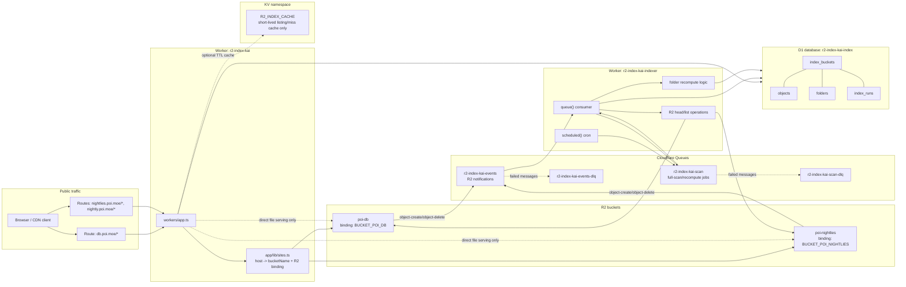

# R2 Offline Directory Index Design

## Goal

Directory listing requests should not scan R2. R2 remains the source of truth for file bodies, but directory metadata is materialized offline into D1 and read by the ingress Worker.

This design makes request-time directory listing complexity proportional to the number of direct children in the requested directory, not the number of descendant objects under that prefix.

```text
R2 bucket
  -> R2 event notification
  -> Cloudflare event Queue
  -> indexer Worker
  -> D1 canonical index
  -> ingress Worker reads D1
```

## Storage decisions

| Data | Storage | Role |
| --- | --- | --- |
| File bodies | R2 | Source of truth |
| File metadata index | D1 | Canonical indexed metadata |
| Folder aggregate index | D1 | Canonical folder size/count/time metadata |
| R2 event stream | Cloudflare Queue | Async indexing and retries |
| Full-scan and recompute jobs | Separate Cloudflare Queue | Isolates heavy jobs from event batching |
| Short-lived listing/miss cache | Existing `R2_INDEX_CACHE` KV | Optional cache only, not source of truth |

D1 is the canonical index store. KV must not be used as the canonical index because folder aggregates require transactional updates, indexed prefix queries, and recomputation after deletes.

## Cloudflare entity graph



Ingress reads D1 for directory listings. The only normal ingress-to-R2 path is direct object serving. R2 listing belongs to the indexer Worker.

## Cloudflare resources

Create one shared D1 database:

```sh
wrangler d1 create r2-index-kai-index
```

Create indexing queues:

```sh
wrangler queues create r2-index-kai-events
wrangler queues create r2-index-kai-events-dlq
wrangler queues create r2-index-kai-scan
wrangler queues create r2-index-kai-scan-dlq
```

Configure R2 event notifications for both buckets:

```sh
wrangler r2 bucket notification create poi-db --event-type object-create --queue r2-index-kai-events
wrangler r2 bucket notification create poi-db --event-type object-delete --queue r2-index-kai-events
wrangler r2 bucket notification create poi-nightlies --event-type object-create --queue r2-index-kai-events
wrangler r2 bucket notification create poi-nightlies --event-type object-delete --queue r2-index-kai-events
```

Use separate notification commands per event type because Cloudflare's documented Wrangler form accepts one `--event-type <EVENT_TYPE>` per command.

## Wrangler configuration

### Ingress Worker

The existing `wrangler.jsonc` should keep current R2 and KV bindings and add the shared D1 binding:

```jsonc
{
  "$schema": "node_modules/wrangler/config-schema.json",
  "name": "r2-index-kai",
  "compatibility_date": "2025-04-04",
  "main": "./workers/app.ts",
  "r2_buckets": [
    { "binding": "BUCKET_POI_DB", "bucket_name": "poi-db" },
    { "binding": "BUCKET_POI_NIGHTLIES", "bucket_name": "poi-nightlies" }
  ],
  "kv_namespaces": [
    {
      "binding": "R2_INDEX_CACHE",
      "id": "<existing-r2-index-cache-kv-id>"
    }
  ],
  "d1_databases": [
    {
      "binding": "R2_INDEX_DB",
      "database_name": "r2-index-kai-index",
      "database_id": "<created-by-wrangler>"
    }
  ],
  "routes": [
    { "pattern": "db.poi.moe/*", "zone_name": "poi.moe" },
    { "pattern": "nightlies.poi.moe/*", "zone_name": "poi.moe" },
    { "pattern": "nightly.poi.moe/*", "zone_name": "poi.moe" }
  ]
}
```

Keep the existing `R2_INDEX_CACHE` KV namespace ID from the current project config. The placeholder above is only for portability in the design document.

### Indexer Worker

Add `wrangler.indexer.jsonc`:

```jsonc
{
  "$schema": "node_modules/wrangler/config-schema.json",
  "name": "r2-index-kai-indexer",
  "compatibility_date": "2025-04-04",
  "main": "./workers/indexer.ts",
  "workers_dev": false,
  "r2_buckets": [
    { "binding": "BUCKET_POI_DB", "bucket_name": "poi-db" },
    { "binding": "BUCKET_POI_NIGHTLIES", "bucket_name": "poi-nightlies" }
  ],
  "d1_databases": [
    {
      "binding": "R2_INDEX_DB",
      "database_name": "r2-index-kai-index",
      "database_id": "<same-database-id-as-ingress>"
    }
  ],
  "queues": {
    "producers": [
      { "binding": "R2_INDEX_SCAN_QUEUE", "queue": "r2-index-kai-scan" }
    ],
    "consumers": [
      {
        "queue": "r2-index-kai-events",
        "max_batch_size": 25,
        "max_batch_timeout": 10,
        "max_retries": 5,
        "dead_letter_queue": "r2-index-kai-events-dlq",
        "max_concurrency": 1
      },
      {
        "queue": "r2-index-kai-scan",
        "max_batch_size": 1,
        "max_batch_timeout": 5,
        "max_retries": 5,
        "dead_letter_queue": "r2-index-kai-scan-dlq",
        "max_concurrency": 1
      }
    ]
  },
  "limits": {
    "cpu_ms": 300000
  },
  "triggers": {
    "crons": ["17 */6 * * *"]
  }
}
```

R2 writes directly to `r2-index-kai-events`, so the indexer does not need a producer binding for that queue. The indexer does need `R2_INDEX_SCAN_QUEUE` so cron and event handlers can enqueue bounded scan/recompute jobs.

Queue concurrency is intentionally capped because the shared D1 database is single-threaded and folder aggregate deltas must be serialized. Event, scan, and recompute jobs run with `max_concurrency: 1` so duplicate events, full-scan finalization, stale cleanup, and large folder recomputes cannot overlap each other.

This design assumes Workers Paid for production-sized buckets. Workers Free limits are useful for development, but the indexer can exceed Free-tier subrequest/query limits when scanning R2 and writing D1. Keep scan pages bounded anyway so one invocation remains small and retryable.

## Site mapping

Update `app/lib/sites.ts` so every site exposes a stable bucket name in addition to the R2 binding:

```ts
interface Site {
  title: string
  bucketName: 'poi-db' | 'poi-nightlies'
  bucket: R2Bucket
  description: string
}
```

Example:

```ts
'db.poi.moe': {
  title: 'poi-db monthly dumps',
  bucketName: 'poi-db',
  bucket: env.BUCKET_POI_DB,
  description: 'poi-db monthly dumps',
}
```

The ingress Worker uses `bucketName` for D1 queries and `bucket` only for direct file serving or an explicitly enabled fallback path.

## D1 schema

Generate the first migration from `shared/db/schema.ts` with `npm run db:generate` and commit the generated SQL under `migrations/`.

All timestamp columns (`*_at`, `uploaded_at`, `created_at`, `modified_at`, `generation`, `lease_expires_at`) use Unix epoch milliseconds. Use `Date.now()` for generated timestamps and `R2Object.uploaded.getTime()` for R2 object upload timestamps. Do not mix seconds and milliseconds.

```sql
CREATE TABLE index_buckets (
  bucket TEXT PRIMARY KEY,
  status TEXT NOT NULL DEFAULT 'pending',
  generation INTEGER NOT NULL DEFAULT 0,
  last_scan_started_at INTEGER,
  last_scan_finished_at INTEGER,
  last_event_at INTEGER,
  updated_at INTEGER NOT NULL
);

CREATE TABLE objects (
  bucket TEXT NOT NULL,
  key TEXT NOT NULL,
  parent_prefix TEXT NOT NULL,
  name TEXT NOT NULL,
  size INTEGER NOT NULL,
  uploaded_at INTEGER NOT NULL,
  etag TEXT,
  seen_generation INTEGER NOT NULL DEFAULT 0,
  updated_at INTEGER NOT NULL,
  PRIMARY KEY (bucket, key)
);

CREATE INDEX objects_by_parent
  ON objects(bucket, parent_prefix, name);

CREATE INDEX objects_by_generation
  ON objects(bucket, seen_generation, updated_at, key);

CREATE TABLE folders (
  bucket TEXT NOT NULL,
  prefix TEXT NOT NULL,
  parent_prefix TEXT,
  name TEXT NOT NULL,
  explicit_marker INTEGER NOT NULL DEFAULT 0,
  marker_seen_generation INTEGER NOT NULL DEFAULT 0,
  size INTEGER NOT NULL DEFAULT 0,
  total_file_count INTEGER NOT NULL DEFAULT 0,
  created_at INTEGER,
  modified_at INTEGER,
  needs_recompute INTEGER NOT NULL DEFAULT 0,
  updated_at INTEGER NOT NULL,
  PRIMARY KEY (bucket, prefix)
);

CREATE INDEX folders_by_parent
  ON folders(bucket, parent_prefix, name);

CREATE INDEX folders_needing_recompute
  ON folders(bucket, needs_recompute);

CREATE TABLE index_runs (
  id TEXT PRIMARY KEY,
  bucket TEXT NOT NULL,
  kind TEXT NOT NULL,
  generation INTEGER NOT NULL,
  cursor TEXT,
  status TEXT NOT NULL,
  lease_expires_at INTEGER,
  started_at INTEGER NOT NULL,
  updated_at INTEGER NOT NULL,
  finished_at INTEGER
);

CREATE INDEX index_runs_by_bucket_status
  ON index_runs(bucket, status, lease_expires_at);

CREATE INDEX index_runs_by_bucket_generation_kind
  ON index_runs(bucket, generation, kind);
```

Root folder is represented by `prefix = ''`, `parent_prefix = NULL`, and `name = ''`.

## Database modeling recommendation

Use Drizzle for schema modeling, query typing, and migration generation, but keep performance-critical indexing operations as explicit D1 prepared SQL.

Recommended package choice for the implementation PR:

```sh
npm install drizzle-orm
npm install --save-dev drizzle-kit
```

Recommended files:

```text
shared/db/schema.ts
app/lib/index-db.ts
drizzle.config.ts
migrations/
```

`drizzle.config.ts` should generate SQLite migrations into the same `migrations/` folder used by Wrangler:

```ts
import { defineConfig } from 'drizzle-kit'

export default defineConfig({
  dialect: 'sqlite',
  schema: './shared/db/schema.ts',
  out: './migrations',
})
```

Use Drizzle's D1 driver for schema-backed runtime helpers that do not need D1 Sessions:

```ts
import { drizzle } from 'drizzle-orm/d1'

const db = drizzle(env.R2_INDEX_DB)
```

For public directory listings, prefer raw prepared SQL over Drizzle so the code can use `env.R2_INDEX_DB.withSession('first-unconstrained')` for D1 read replication. Treat Drizzle as the schema/type/migration source and use raw SQL where D1-specific session or batching behavior matters.

Recommended split:

| Area | Use Drizzle? | Reason |
| --- | --- | --- |
| Table definitions | Yes | Single typed schema for Workers and migrations |
| Simple ingress listing reads | Prefer raw prepared SQL | D1 read replication requires `withSession()`, which should stay explicit |
| Status/admin queries | Yes | Low complexity and easier maintenance |
| Full-scan upserts | Mixed | Drizzle schema/types are useful, but D1 `batch()` with prepared SQL gives tighter control |
| Folder aggregate recompute | Prefer raw prepared SQL | Aggregate range queries and D1 limits need predictable SQL and binding counts |
| Migrations at runtime | No | Generate SQL ahead of time; apply with Wrangler D1 migrations |

Do not run migration tooling from Workers. Generate migration SQL during development with `drizzle-kit generate`, review the SQL, commit it under `migrations/`, and apply it with:

```sh
wrangler d1 migrations apply r2-index-kai-index --remote
```

Drizzle is recommended here because the schema is non-trivial but still SQLite-compatible. It gives type-safe D1 access without forcing the indexer to hide important D1 performance constraints behind ORM abstractions.

## Implementation-ready contracts

The implementation should add these package scripts:

```jsonc
{
  "scripts": {
    "db:generate": "drizzle-kit generate",
    "db:migrate:local": "wrangler d1 migrations apply r2-index-kai-index --local",
    "db:migrate:remote": "wrangler d1 migrations apply r2-index-kai-index --remote",
    "deploy:ingress": "npm run build && wrangler deploy",
    "deploy:indexer": "wrangler deploy --config wrangler.indexer.jsonc",
    "deploy:all": "npm run deploy:ingress && npm run deploy:indexer"
  }
}
```

Add dependencies in the implementation PR:

```text
dependencies:
  drizzle-orm

devDependencies:
  drizzle-kit
```

Use the latest available package versions when adding them.

Define explicit runtime env types instead of relying on one global `Env` shape for both Workers:

```ts
export interface IngressEnv {
  R2_INDEX_CACHE: KVNamespace
  R2_INDEX_DB: D1Database
  BUCKET_POI_DB: R2Bucket
  BUCKET_POI_NIGHTLIES: R2Bucket
  INDEX_LIVE_FALLBACK?: 'true' | 'false'
}

export interface IndexerEnv {
  R2_INDEX_DB: D1Database
  R2_INDEX_SCAN_QUEUE: Queue<ScanJob>
  BUCKET_POI_DB: R2Bucket
  BUCKET_POI_NIGHTLIES: R2Bucket
}
```

Use these module contracts:

```ts
// shared/buckets.ts
export type BucketName = 'poi-db' | 'poi-nightlies'
export const bucketNames = ['poi-db', 'poi-nightlies'] as const

// shared/prefix.ts
export function isFolderMarkerKey(key: string): boolean
export function normalizeObjectKeyForIndex(key: string): string
export function getParentPrefix(key: string): string
export function getName(key: string): string
export function getAncestorPrefixes(key: string): string[]
export function getPrefixUpperBound(prefix: string): string | null

// app/lib/index-db.ts
export interface DirectoryEntry {
  key: string
  href: string
  type: 'file' | 'folder'
  size: number
  created?: number
  modified?: number
}
export type D1Queryable = Pick<D1Database, 'prepare' | 'batch'> | D1DatabaseSession
export async function listIndexedDirectory(
  db: D1Queryable,
  bucket: BucketName,
  prefix: string,
): Promise<DirectoryEntry[]>

// workers/indexer/jobs.ts
export function enqueueFullScan(
  queue: Queue<ScanJob>,
  bucket: BucketName,
  generation: number,
  cursor?: string,
): Promise<void>
export function enqueueRecomputeFolders(
  queue: Queue<ScanJob>,
  bucket: BucketName,
  prefixes: string[],
): Promise<void>

// workers/indexer/r2-events.ts
export function normalizeR2Event(body: unknown): R2EventNotification
export async function handleR2Event(env: IndexerEnv, event: R2EventNotification): Promise<void>

// workers/indexer/full-scan.ts
export async function startFullScan(env: IndexerEnv, bucket: BucketName): Promise<void>
export async function handleFullScanPage(env: IndexerEnv, job: Extract<ScanJob, { kind: 'full-scan-page' }>): Promise<void>
export async function finishFullScan(env: IndexerEnv, job: Extract<ScanJob, { kind: 'finish-full-scan' }>): Promise<void>

// workers/indexer/folders.ts
export async function applyCreateOrOverwriteFolderDeltas(
  env: IndexerEnv,
  bucket: BucketName,
  oldObject: IndexedObject | null,
  newObject: IndexedObject,
): Promise<string[]>
export async function applyDeleteFolderDeltas(
  env: IndexerEnv,
  bucket: BucketName,
  oldObject: IndexedObject,
): Promise<string[]>
export async function recomputeFolders(env: IndexerEnv, bucket: BucketName, prefixes: string[]): Promise<void>
```

Queue entrypoint behavior:

```ts
export default {
  async queue(batch, env) {
    for (const message of batch.messages) {
      try {
        if (batch.queue === 'r2-index-kai-events') {
          await handleR2Event(env, normalizeR2Event(message.body))
        } else {
          await handleScanJob(env, message.body)
        }
        message.ack()
      } catch (error) {
        console.error('indexer job failed', {
          queue: batch.queue,
          messageId: message.id,
          attempts: message.attempts,
          error,
        })
        message.retry({ delaySeconds: Math.min(300, 2 ** message.attempts) })
      }
    }
  },
}
```

Do not use `Promise.all(batch.messages.map(...))` for event batches. Per-message acknowledgement keeps successful events from retrying when another message in the same batch fails.

Raw D1 statement inventory for indexer hot paths:

```sql
-- get active bucket state
SELECT bucket, status, generation, last_scan_started_at
FROM index_buckets
WHERE bucket = ?;

-- upsert bucket scan state
INSERT INTO index_buckets (
  bucket, status, generation, last_scan_started_at, updated_at
) VALUES (?, 'scanning', ?, ?, ?)
ON CONFLICT(bucket) DO UPDATE SET
  status = 'scanning',
  generation = excluded.generation,
  last_scan_started_at = excluded.last_scan_started_at,
  updated_at = excluded.updated_at;

-- upsert object
INSERT INTO objects (
  bucket, key, parent_prefix, name, size, uploaded_at, etag, seen_generation, updated_at
) VALUES (?, ?, ?, ?, ?, ?, ?, ?, ?)
ON CONFLICT(bucket, key) DO UPDATE SET
  parent_prefix = excluded.parent_prefix,
  name = excluded.name,
  size = excluded.size,
  uploaded_at = excluded.uploaded_at,
  etag = excluded.etag,
  seen_generation = excluded.seen_generation,
  updated_at = excluded.updated_at;

-- ensure folder
INSERT INTO folders (
  bucket, prefix, parent_prefix, name, explicit_marker, updated_at
) VALUES (?, ?, ?, ?, ?, ?)
ON CONFLICT(bucket, prefix) DO NOTHING;

-- set explicit folder marker
UPDATE folders
SET explicit_marker = ?, updated_at = ?
WHERE bucket = ? AND prefix = ?;

-- mark folder dirty
UPDATE folders
SET needs_recompute = 1, updated_at = ?
WHERE bucket = ? AND prefix = ?;

-- read ancestor folder stats for boundary detection
SELECT prefix, created_at, modified_at
FROM folders
WHERE bucket = ? AND prefix IN (?, ...);

-- apply folder delta
UPDATE folders
SET
  size = size + ?,
  total_file_count = total_file_count + ?,
  created_at = CASE
    WHEN created_at IS NULL THEN ?
    WHEN ? IS NULL THEN created_at
    ELSE MIN(created_at, ?)
  END,
  modified_at = CASE
    WHEN modified_at IS NULL THEN ?
    WHEN ? IS NULL THEN modified_at
    ELSE MAX(modified_at, ?)
  END,
  updated_at = ?
WHERE bucket = ? AND prefix = ?;

-- delete object
DELETE FROM objects
WHERE bucket = ? AND key = ?;

-- stale cleanup page
SELECT key, size, uploaded_at
FROM objects
WHERE bucket = ?
  AND seen_generation < ?
  AND updated_at < ?
  AND key > COALESCE(?, '')
ORDER BY key
LIMIT 100;

-- finalize bucket scan state
UPDATE index_buckets
SET
  status = 'ready',
  last_scan_finished_at = ?,
  updated_at = ?
WHERE bucket = ? AND generation = ?;

-- finalize scan run
UPDATE index_runs
SET
  status = 'finished',
  finished_at = ?,
  updated_at = ?,
  lease_expires_at = NULL
WHERE bucket = ? AND generation = ? AND kind = 'full-scan';

-- delete empty non-marker folder with no child folders
DELETE FROM folders
WHERE bucket = ?
  AND prefix = ?
  AND prefix != ''
  AND explicit_marker = 0
  AND total_file_count = 0
  AND NOT EXISTS (
    SELECT 1
    FROM folders child
    WHERE child.bucket = folders.bucket
      AND child.parent_prefix = folders.prefix
  );
```

Use `env.R2_INDEX_DB.batch()` for groups of prepared statements where all statements must succeed together. Cloudflare's 100-bound-parameter limit applies to each SQL statement, not the whole batch, but batches should still stay small for latency and query-count control. With the current object upsert shape, process at most 10 objects per D1 batch and loop inside the 50-object R2 scan page.

When a query uses `prefix IN (?, ...)`, chunk ancestor prefixes to at most 80 values per statement. This leaves room for bucket/time parameters and avoids Cloudflare's 100-bound-parameter limit even for deeply nested object keys.

Local development and test fixtures:

```text
fixtures/r2-index/
  initial-objects.json
  r2-create-event.json
  r2-delete-event.json
```

## Validation plan

The implementation PR must include automated unit tests, local integration tests, and offline local Worker E2E tests using Cloudflare's Workers Vitest integration. E2E validation must not require Cloudflare tokens, remote resources, preview deployments, or writes to the real Cloudflare account.

Add these package scripts:

```jsonc
{
  "scripts": {
    "test": "vitest run",
    "test:unit": "vitest run shared workers/indexer app/lib",
    "test:worker:indexer": "vitest run --config vitest.worker.indexer.config.ts",
    "test:worker:ingress": "vitest run --config vitest.worker.ingress.config.ts",
    "test:worker": "npm run test:worker:indexer && npm run test:worker:ingress",
    "test:e2e": "npm run test:worker",
    "test:e2e:offline": "npm run test:worker",
    "test:integration": "vitest run tests/integration && npm run test:worker"
  }
}
```

If no test runner exists yet, add Vitest. For Worker behavior, use Cloudflare's Workers Vitest integration (`@cloudflare/vitest-pool-workers`) rather than remote preview tests. Cloudflare's integration runs tests locally in the Workers runtime using Miniflare, exposes local bindings, supports isolated per-test-file storage, and provides helpers for `queue()` and `scheduled()` handlers.

Add test dependencies in the implementation PR:

```text
devDependencies:
  vitest
  @cloudflare/vitest-pool-workers
```

Add `vitest.worker.indexer.config.ts`:

```ts
import { cloudflareTest } from '@cloudflare/vitest-pool-workers'
import { readD1Migrations } from '@cloudflare/vitest-pool-workers/config'
import { defineConfig } from 'vitest/config'

export default defineConfig({
  plugins: [
    cloudflareTest(async () => ({
      wrangler: {
        configPath: './wrangler.indexer.jsonc',
      },
      miniflare: {
        bindings: {
          TEST_MIGRATIONS: await readD1Migrations('./migrations'),
        },
      },
    })),
  ],
  test: {
    setupFiles: ['./tests/worker/apply-migrations.ts'],
  },
})
```

Add `vitest.worker.ingress.config.ts` with the same migration setup but `wrangler.configPath: './wrangler.jsonc'`.

`tests/worker/apply-migrations.ts` should apply D1 migrations before each Worker integration test and reset bindings after each test:

```ts
import { env } from 'cloudflare:workers'
import { applyD1Migrations, reset } from 'cloudflare:test'
import { afterEach, beforeEach } from 'vitest'

declare module 'cloudflare:workers' {
  interface ProvidedEnv extends IndexerEnv {
    TEST_MIGRATIONS: D1Migration[]
  }
}

beforeEach(async () => {
  await applyD1Migrations(env.R2_INDEX_DB, env.TEST_MIGRATIONS)
})

afterEach(async () => {
  await reset()
})
```

### Unit tests

Unit tests must not require Cloudflare resources.

Required coverage:

```text
shared/prefix.test.ts
  - root prefix
  - single-level key
  - nested key
  - no-slash key
  - Unicode key
  - trailing-slash folder marker key
  - folder marker key does not self-parent
  - getPrefixUpperBound ordering

shared/buckets.test.ts
  - known bucket names resolve
  - unknown bucket name is rejected

workers/indexer/r2-events.test.ts
  - PutObject -> create
  - CopyObject -> create
  - CompleteMultipartUpload -> create
  - DeleteObject -> delete
  - LifecycleDeletion -> delete
  - malformed payload throws and does not ack

workers/indexer/jobs.test.ts
  - recompute prefixes are chunked to <= 25
  - retry delay is capped
  - scan jobs are serialized as JSON-compatible Queue bodies
```

### Local integration tests

Integration tests should be split into two layers:

1. Pure integration tests for SQL helpers and fake R2/Queue adapters.
2. Worker integration tests running in Cloudflare's local Workers Vitest pool.

Required scenarios:

```text
tests/integration/indexer-create.test.ts
  - seed empty D1
  - fake R2 head() returns a new object
  - handle create event
  - assert objects row exists
  - assert root and parent folders exist and are dirty
  - assert recompute job was enqueued

tests/integration/indexer-delete.test.ts
  - seed object and folder rows
  - fake R2 head() returns null
  - handle delete event
  - assert object row is gone
  - assert old ancestors are dirty
  - assert recompute job was enqueued

tests/integration/full-scan-page.test.ts
  - fake R2 list() returns objects and cursor
  - fake R2 head() returns current metadata for one object
  - fake R2 head() returns null for one deleted object
  - assert only current object is upserted
  - assert next scan page is enqueued when cursor exists

tests/integration/recompute-folders.test.ts
  - seed nested object rows
  - recompute root and nested prefixes
  - assert size, total_file_count, created_at, modified_at
  - assert empty non-root folder is deleted

tests/integration/ingress-listing.test.ts
  - seed D1 folder and file rows
  - call listIndexedDirectory()
  - assert folder and file result shape matches FileListing
  - assert no R2 bucket method is called when INDEX_LIVE_FALLBACK is false
```

### Offline local Worker E2E tests

Use Cloudflare's `cloudflare:test` helpers for offline local Worker E2E coverage. These tests run against Miniflare-local D1/R2/KV/Queue bindings and must not call Wrangler remote commands or deployed Workers:

```text
tests/worker/indexer-queue.test.ts
  - createMessageBatch('r2-index-kai-events', [create notification])
  - call indexer.queue(batch, env, ctx)
  - getQueueResult(batch, ctx)
  - assert explicitAcks contains the message id
  - assert D1 object row exists
  - assert recompute job was sent to R2_INDEX_SCAN_QUEUE

tests/worker/indexer-scheduled.test.ts
  - createScheduledController({ cron: '17 */6 * * *' })
  - call indexer.scheduled(controller, env, ctx)
  - assert full-scan jobs are sent for both buckets
  - assert index_buckets rows are marked scanning

tests/worker/indexer-retry.test.ts
  - configure a failing D1/R2 path
  - call queue handler
  - getQueueResult(batch, ctx)
  - assert the failed message is retried, not acked

tests/worker/ingress-fetch.test.ts
  - seed D1 with a directory listing
  - call ingress fetch/loader through the ingress Worker runtime
  - assert rendered response uses indexed rows
  - assert direct R2 listing is not required
```

Use `createMessageBatch()`, `createScheduledController()`, `createExecutionContext()`, `getQueueResult()`, and `waitOnExecutionContext()` from `cloudflare:test`. Use `env` from `cloudflare:workers` for local D1, R2, KV, and Queue bindings.

### Optional operator smoke checklist

Do not automate this checklist in CI and do not make it a merge requirement. It is optional manual validation for an operator who already has local Cloudflare credentials and wants to verify platform-managed R2 notification rules after deployment.

Real bucket event notification delivery can be spot-checked once per environment after Cloudflare notification rules are configured:

```text
1. Upload a tiny object to the isolated test prefix.
2. Confirm the event Queue receives and processes the create notification.
3. Delete the object.
4. Confirm the event Queue receives and processes the delete notification.
5. Confirm both messages are absent from the DLQ.
```

Implementation acceptance criteria:

```text
1. `npm run build` succeeds.
2. `npm run typecheck` succeeds or only shows an explicitly documented pre-existing React Router typegen issue.
3. `drizzle-kit generate` creates the D1 migration from `shared/db/schema.ts`.
4. `wrangler d1 migrations apply r2-index-kai-index --local` succeeds.
5. `npm run test:unit` succeeds.
6. `npm run test:integration` succeeds.
7. `npm run test:e2e:offline` succeeds using Cloudflare's Workers Vitest integration and local Miniflare bindings.
8. Prefix helper tests cover root, single-level, nested, Unicode, and no-slash keys.
9. R2 event normalization tests cover PutObject, CopyObject, CompleteMultipartUpload, DeleteObject, and LifecycleDeletion.
10. Synthetic create event upserts an object row and dirties all ancestor folders.
11. Synthetic delete event deletes the object row and dirties old ancestor folders.
12. A full-scan page with a deleted object skips it after `head()` returns null.
13. Ingress directory loader reads from D1 and does not call `bucket.list()` when `INDEX_LIVE_FALLBACK` is false.
14. The PR effective diff has no direct request-time folder-size scan implementation.
```

## Prefix rules

Use these helpers consistently. The snippets below show implementation logic; the real `shared/prefix.ts` module should export each helper to match the contracts above.

```ts
const isFolderMarkerKey = (key: string) => {
  return key !== '' && key.endsWith('/')
}

const normalizeObjectKeyForIndex = (key: string) => {
  if (!isFolderMarkerKey(key)) {
    return key
  }
  return key.slice(0, -1)
}

const getParentPrefix = (key: string) => {
  const normalized = normalizeObjectKeyForIndex(key)
  const index = normalized.lastIndexOf('/')
  return index === -1 ? '' : normalized.slice(0, index + 1)
}

const getName = (key: string) => {
  const normalized = normalizeObjectKeyForIndex(key)
  const index = normalized.lastIndexOf('/')
  return index === -1 ? normalized : normalized.slice(index + 1)
}

const getAncestorPrefixes = (key: string) => {
  const prefixes = ['']
  const normalized = normalizeObjectKeyForIndex(key)
  let slash = normalized.indexOf('/')
  while (slash !== -1) {
    prefixes.push(normalized.slice(0, slash + 1))
    slash = normalized.indexOf('/', slash + 1)
  }
  return prefixes
}

const getPrefixUpperBound = (prefix: string) => {
  if (prefix === '') {
    return null
  }

  const codePoints = Array.from(prefix)
  const last = codePoints.at(-1)
  if (last === undefined) {
    return null
  }

  const lastCodePoint = last.codePointAt(0)!
  if (lastCodePoint >= 0x10ffff) {
    return null
  }

  return `${codePoints.slice(0, -1).join('')}${String.fromCodePoint(lastCodePoint + 1)}`
}
```

For `a/b/file.zip`:

```text
parent_prefix = "a/b/"
name = "file.zip"
ancestors = ["", "a/", "a/b/"]
```

For folder-marker object `a/b/`:

```text
isFolderMarkerKey = true
normalized = "a/b"
folder prefix = "a/b/"
parent_prefix = "a/"
name = "b"
ancestors = ["", "a/"]
```

Folder-marker objects are not inserted into `objects`, do not contribute to `size`, and do not increment `total_file_count`. They only set `folders.explicit_marker = 1` and `folders.marker_seen_generation = current generation` so intentionally empty folders can be listed and full scans can repair deleted markers. Deleting a folder-marker object sets `explicit_marker = 0`; the folder row is deleted only if `total_file_count = 0` and there are no child folders.

Folder metadata definitions:

```text
folder.size = SUM(size of descendant files)
folder.total_file_count = COUNT(descendant files)
folder.created_at = MIN(uploaded_at of descendant files)
folder.modified_at = MAX(uploaded_at of descendant files)
```

R2 has no real folders, so `created_at` is inferred as the earliest descendant upload time.

Use lexicographic range queries over `(bucket, key)` for descendant scans. Do not use `LIKE prefix || '%'`: Cloudflare D1 documents a 50-byte limit for `LIKE` or `GLOB` patterns, which makes long object prefixes unsafe.

## Ingress listing query

Use a D1 Session for read-only listing queries:

```ts
const db = env.R2_INDEX_DB.withSession('first-unconstrained')
```

`first-unconstrained` allows D1 read replication to serve public directory listings from replicas after the index is ready. Use `first-primary` only for operational/admin views that must observe the newest index write.

For a directory prefix:

```sql
SELECT
  'folder' AS type,
  prefix AS key,
  name,
  size,
  created_at AS created,
  modified_at AS modified
FROM folders
WHERE bucket = ? AND parent_prefix = ?

UNION ALL

SELECT
  'file' AS type,
  key,
  name,
  size,
  uploaded_at AS created,
  uploaded_at AS modified
FROM objects
WHERE bucket = ? AND parent_prefix = ?

ORDER BY type DESC, name COLLATE NOCASE;
```

Request-time complexity:

```text
O(number of direct children in the requested directory)
```

The route should return 404 when:

```text
no matching object rows
and no matching folder rows
and prefix is not root
```

The route should not call `bucket.list()` for normal directory listings.

## Cloudflare documentation constraints

This design depends on these Cloudflare-documented constraints:

| Area | Constraint | Design response |
| --- | --- | --- |
| R2 event notifications | Event types are `object-create` and `object-delete`; Queue message bodies contain `action`, `bucket`, `object.key`, `eventTime`, and omit size/eTag for deletes. | Normalize Cloudflare event bodies before updating D1; use `bucket.head(key)` for current create metadata and stale delete detection. |
| R2 list API | `list()` returns at most 1000 objects, may return fewer, and pagination must use `truncated` and `cursor`. | Full scan jobs always advance by cursor and never infer completion from object count. |
| Queues | Max consumer batch size is 100; consumer wall time is 15 minutes; default CPU is lower unless configured. | Use separate queues, `max_batch_size: 1` for scan jobs, and `limits.cpu_ms: 300000` on the indexer. |
| D1 | One database is single-threaded, max size is 10 GB on Workers Paid, max query duration is 30 seconds, max bound parameters per query is 100, and query count per Worker invocation is limited. | Keep D1 writes bounded, remove the `object_ancestors` table, chunk recomputes, and use KV/read replication for hot listing reads if needed. |
| D1 read replication | Read replicas are only used through the Sessions API. | Ingress should read operational readiness from `first-primary`, then use `R2_INDEX_DB.withSession('first-unconstrained')` for directory listing rows after the index is ready. |
| Queue acknowledgement | Messages are acknowledged when the `queue()` handler resolves; individual messages can also call `ack()` or `retry()`. | Process event messages independently and explicitly `ack()` only after D1 writes plus scan-job enqueue succeed. |

If either bucket's estimated index approaches 5 GB or D1 overload errors appear during scans, split into one D1 database per bucket before adding more features.

Source-of-truth documentation checked for this design:

- https://developers.cloudflare.com/r2/buckets/event-notifications/
- https://developers.cloudflare.com/r2/api/workers/workers-api-reference/
- https://developers.cloudflare.com/queues/configuration/configure-queues/
- https://developers.cloudflare.com/queues/configuration/consumer-concurrency/
- https://developers.cloudflare.com/queues/configuration/javascript-apis/
- https://developers.cloudflare.com/queues/platform/limits/
- https://developers.cloudflare.com/d1/platform/limits/
- https://developers.cloudflare.com/d1/worker-api/d1-database/
- https://developers.cloudflare.com/d1/best-practices/use-indexes/
- https://developers.cloudflare.com/d1/best-practices/read-replication/
- https://developers.cloudflare.com/workers/testing/vitest-integration/
- https://developers.cloudflare.com/workers/testing/vitest-integration/configuration/
- https://developers.cloudflare.com/workers/testing/vitest-integration/test-apis/
- https://orm.drizzle.team/docs/sqlite/connect-cloudflare-d1
- https://orm.drizzle.team/docs/drizzle-kit-generate
- https://orm.drizzle.team/docs/drizzle-kit-migrate

## Indexer job types

R2 event notifications arrive on `r2-index-kai-events` using Cloudflare's documented message body:

```ts
type R2EventNotification = {
  action: 'PutObject' | 'CopyObject' | 'CompleteMultipartUpload' | 'DeleteObject' | 'LifecycleDeletion'
  bucket: 'poi-db' | 'poi-nightlies'
  object: {
    key: string
    size?: number
    eTag?: string
  }
  eventTime: string
}
```

Full-scan and recompute jobs are internal messages on `r2-index-kai-scan`:

```ts
type ScanJob =
  | {
      kind: 'full-scan-page'
      bucket: 'poi-db' | 'poi-nightlies'
      generation: number
      cursor?: string
    }
  | {
      kind: 'finish-full-scan'
      bucket: 'poi-db' | 'poi-nightlies'
      generation: number
    }
  | {
      kind: 'cleanup-stale-page'
      bucket: 'poi-db' | 'poi-nightlies'
      generation: number
      afterKey?: string
    }
  | {
      kind: 'recompute-folders'
      bucket: 'poi-db' | 'poi-nightlies'
      prefixes: string[]
    }
  | {
      kind: 'finalize-full-scan'
      bucket: 'poi-db' | 'poi-nightlies'
      generation: number
    }
```

## Full scan flow

Scheduled handler runs every six hours.

For each configured bucket:

```text
1. If a non-expired scan lease exists for the bucket, skip.
2. Set generation = Date.now().
3. Upsert index_buckets row with status = 'scanning'.
4. Upsert index_runs row with lease_expires_at.
5. Enqueue full-scan-page with no cursor to R2_INDEX_SCAN_QUEUE.
```

`full-scan-page` handler:

```text
1. Resolve bucket name to R2 binding.
2. List R2 with limit 10, no delimiter, and the job cursor.
3. For each object:
   - run `bucket.head(object.key)` and skip the object if it no longer exists
   - use the `head()` result, not the possibly stale list item, for size/uploaded/etag
   - if `isFolderMarkerKey(object.key)` is true, ensure the corresponding folder row, set `explicit_marker = 1`, mark ancestors dirty if needed, and do not insert an `objects` row
   - compute parent_prefix, name, ancestors
   - upsert objects row
   - set seen_generation = job.generation
   - ensure folders rows for each ancestor
   - mark affected folders needs_recompute = 1
4. Extend the scan lease.
5. If R2 returned a cursor, enqueue the next full-scan-page.
6. If no cursor, enqueue finish-full-scan.
```

R2 allows up to 1000 listed objects per call, but this design intentionally uses 10. The lower page size keeps D1 writes below per-invocation query limits after folder rows and dirty flags are included.

The per-object `head()` call is intentional. It prevents a full-scan page from resurrecting an object that was listed just before a concurrent delete or overwrite event was processed.

`finish-full-scan` handler:

```text
1. Enqueue cleanup-stale-page with no afterKey.
```

`cleanup-stale-page` handler:

```text
1. Find at most 100 stale objects where `seen_generation < generation`, `updated_at < last_scan_started_at`, and `key > afterKey` when afterKey exists.
2. For each stale object:
   - mark old ancestors needs_recompute = 1
   - delete object row
3. If 100 rows were found, enqueue another cleanup-stale-page with afterKey set to the last processed key.
4. If no more stale rows exist, query dirty folder prefixes in pages of 250 and enqueue recompute-folders jobs in chunks of at most 25 prefixes.
5. Enqueue finalize-full-scan.
```

`finalize-full-scan` handler:

```text
1. If any folders still have needs_recompute = 1, enqueue another finalize-full-scan with delay and return.
2. Delete empty folder rows except the root folder and explicit folder-marker rows.
3. Mark index_buckets status = 'ready' and set last_scan_finished_at = Date.now().
4. Mark the index_runs row status = 'finished' and set finished_at = Date.now().
5. Clear the scan lease.
```

The full scan never loads the whole bucket into memory.

## Event update flow

### Create or overwrite

```text
1. Accept actions PutObject, CopyObject, and CompleteMultipartUpload as creates.
2. Resolve event bucket to R2 binding.
3. Run bucket.head(object.key).
4. If head returns null, process as delete.
5. If `isFolderMarkerKey(object.key)` is true, ensure the corresponding folder row, set `explicit_marker = 1`, update `index_buckets.last_event_at`, acknowledge the event, and stop.
6. Read old objects row.
7. Upsert the objects row with current size/uploaded/etag.
8. If `index_buckets.status = 'scanning'`, set `seen_generation` to the active bucket generation so a concurrent full scan cannot delete this fresh object as stale.
9. Ensure folder rows exist for all old and new ancestors.
10. Apply folder deltas to old and new ancestors:
   - new object: `size += new.size`, `total_file_count += 1`, `created_at = min(created_at, new.uploaded_at)`, `modified_at = max(modified_at, new.uploaded_at)`
   - overwrite: `size += new.size - old.size`, `total_file_count += 0`
11. If an overwrite changes a timestamp that currently equals an ancestor folder's `created_at` or `modified_at`, mark that ancestor dirty and enqueue recompute-folders for only those boundary-affected ancestors.
12. Acknowledge the event only after the D1 writes and recompute enqueue succeed.
13. Update index_buckets.last_event_at.
```

Do not recompute every ancestor on every create event. The root folder may contain the whole bucket, so request-time-like full subtree recomputes must not happen in normal event handling. Use arithmetic deltas for size/count and reserve range-query recomputes for timestamp-boundary cases.

Boundary recomputes are queued scan jobs, never inline event work. If the root prefix `''` is boundary-affected and the bucket is large enough to risk D1 query-duration limits, mark root dirty and let the next scheduled full scan repair root `created_at`/`modified_at` instead of attempting a huge immediate root range query.

### Delete

```text
1. Accept actions DeleteObject and LifecycleDeletion as deletes.
2. Resolve event bucket to R2 binding.
3. Run bucket.head(object.key).
4. If object still exists, ignore the delete event as stale/out-of-order.
5. If `isFolderMarkerKey(object.key)` is true, set the corresponding folder row `explicit_marker = 0`, delete the folder row only when it has no files and no child folders, update `index_buckets.last_event_at`, acknowledge the event, and stop.
6. Read old objects row.
7. If missing, no-op.
8. Apply folder deltas to old ancestors: `size -= old.size`, `total_file_count -= 1`.
9. If the deleted object's `uploaded_at` equals an ancestor folder's `created_at` or `modified_at`, mark that ancestor dirty and enqueue recompute-folders for only those boundary-affected ancestors.
10. Delete object row.
11. Acknowledge the event only after the D1 writes and recompute enqueue succeed.
12. Update index_buckets.last_event_at.
```

Duplicate events are safe because all operations are idempotent.

The event consumer should not process a whole batch with `Promise.all` and then rely on all-or-nothing batch acknowledgement. Process each message independently with bounded concurrency, call `message.ack()` after that message's D1 writes and scan-queue enqueue succeed, and call `message.retry({ delaySeconds })` for recoverable D1/R2/Queue failures.

## Folder recomputation

Each `recompute-folders` job must contain at most 25 prefixes. For each prefix, compute `upperBound = getPrefixUpperBound(prefix)` and run one aggregate query.

For the root prefix, omit the upper-bound predicate:

```sql
SELECT
  COALESCE(SUM(size), 0) AS size,
  COUNT(*) AS total_file_count,
  MIN(uploaded_at) AS created_at,
  MAX(uploaded_at) AS modified_at
FROM objects
WHERE bucket = ?;
```

For non-root prefixes:

```sql
SELECT
  COALESCE(SUM(size), 0) AS size,
  COUNT(*) AS total_file_count,
  MIN(uploaded_at) AS created_at,
  MAX(uploaded_at) AS modified_at
FROM objects
WHERE bucket = ?
  AND key >= ?
  AND key < ?;
```

Then update the folder:

```sql
UPDATE folders
SET
  size = ?,
  total_file_count = ?,
  created_at = ?,
  modified_at = ?,
  needs_recompute = 0,
  updated_at = ?
WHERE bucket = ?
  AND prefix = ?;
```

After a recompute sets `total_file_count = 0`, delete that folder row only when `prefix != ''`, `explicit_marker = 0`, and no child folder has `parent_prefix = folders.prefix`.

## Worker code layout

Do not convert this repository into a monorepo for the first implementation. Keep one npm package with multiple Worker entrypoints and multiple Wrangler configs.

Reasons:

- The ingress Worker and indexer Worker share the same Cloudflare account resources, D1 schema, bucket names, and TypeScript types.
- The dependency set is small; separate packages would add workspace/build complexity without isolating much.
- The current repository already has a single React Router app plus `workers/app.ts`; adding `workers/indexer.ts` fits the existing shape.
- Deployment separation is already handled by separate Wrangler configs, so package separation is not required.

Use this layout:

```text
app/
  lib/
    index-db.ts              # ingress-side read queries only
    sites.ts                 # host -> bucketName + R2 binding
  routes/
    catch-all.tsx

shared/
  buckets.ts                 # bucket-name constants and binding resolver types
  prefix.ts                  # getParentPrefix/getName/getAncestorPrefixes helpers
  db/
    schema.ts                # Drizzle table definitions
    types.ts                 # shared row/result types

workers/
  app.ts                     # existing React Router ingress Worker entry
  indexer.ts                 # indexer Worker entrypoint: queue() + scheduled()
  indexer/
    jobs.ts                  # ScanJob and dispatch helpers
    r2-events.ts             # R2 notification normalization and event handling
    folders.ts               # folder recompute logic
    full-scan.ts             # paginated R2 scan jobs
    buckets.ts               # R2 binding resolver for indexer

wrangler.jsonc               # ingress Worker config
wrangler.indexer.jsonc       # indexer Worker config
drizzle.config.ts
migrations/
```

`shared/` is pure TypeScript. It must not import React, React Router, Worker entry modules, or request-specific code. Both `app/` and `workers/` may import from `shared/`.

Update TypeScript/Vite path aliases when adding `shared/`:

```jsonc
{
  "compilerOptions": {
    "paths": {
      "@/*": ["./app/*"],
      "~/*": ["./shared/*"]
    }
  }
}
```

Also add `shared/**/*` to `tsconfig.cloudflare.json` includes. For Vite, keep `@` for app imports and add a `~` alias to `./shared`.

Rules:

- `app/lib/index-db.ts` contains ingress-side D1 reads only.
- `workers/indexer/*` contains all D1 writes, full scans, Queue handling, and folder recompute logic.
- `shared/db/schema.ts` is the only schema definition source used by Drizzle and runtime code.
- Do not import from `app/` inside `workers/indexer/*`; use `shared/` instead.
- Do not import from `workers/` inside React components; route loaders should use `app/lib/*` and `shared/*`.

Reconsider a monorepo only if the project later has independent deploy pipelines, incompatible dependency sets, or reusable packages published outside this repository.

## Ingress fallback policy

Use a string-backed Worker configuration flag:

```ts
const isLiveFallbackEnabled = (env: IngressEnv) =>
  env.INDEX_LIVE_FALLBACK === 'true'
```

Production should omit `INDEX_LIVE_FALLBACK` or set it to `'false'`. Treat only the exact string `'true'` as enabled; do not use truthiness for this flag.

Production target behavior:

```text
manifest/index ready -> read D1 and render
index missing/stale -> return 503 "index not ready" or 404 when prefix is known absent
```

During migration only:

```text
if INDEX_LIVE_FALLBACK is true:
  live-scan R2
  return listing
  enqueue scan/recompute
```

Fallback should be disabled once both buckets are fully indexed.

## Complexity

| Operation | Complexity |
| --- | --- |
| Directory request | O(direct children) |
| Full scan | O(total objects * path depth), offline |
| Create/overwrite event | O(path depth), plus queued recompute only for timestamp-boundary cases |
| Delete event | O(path depth), plus queued recompute only for timestamp-boundary cases |
| Folder recompute | O(descendant files of dirty folder), offline range query |

The important constraint is that expensive descendant work happens in the indexer, not in the ingress request path.

## Deployment sequence

1. Create D1 database and all four Queues.
2. Add D1 binding to `wrangler.jsonc`.
3. Add `wrangler.indexer.jsonc`.
4. Add D1 migration and apply it:

   ```sh
   wrangler d1 migrations apply r2-index-kai-index --remote
   ```

5. Deploy indexer Worker.
6. Configure R2 event notifications for both buckets.
7. Trigger or wait for a full scan for `poi-db` and `poi-nightlies`.
8. Confirm `index_buckets.status = 'ready'` for both buckets.
9. Change ingress directory listing route to read from D1.
10. Deploy ingress Worker.
11. Enable D1 read replication if listing latency or read throughput becomes a bottleneck.
12. Disable live R2 listing fallback in production.

## Operational checks

Useful D1 checks:

```sql
SELECT bucket, status, generation, last_scan_finished_at, last_event_at
FROM index_buckets;
```

```sql
SELECT bucket, COUNT(*) AS object_count
FROM objects
GROUP BY bucket;
```

```sql
SELECT bucket, COUNT(*) AS dirty_folders
FROM folders
WHERE needs_recompute = 1
GROUP BY bucket;
```

The indexer should log:

```text
bucket
job kind
generation
cursor presence
objects processed
folders recomputed
queue batch size
error details
```

Avoid swallowing indexing errors; failed Queue messages should retry and eventually land in the dead-letter queue.
