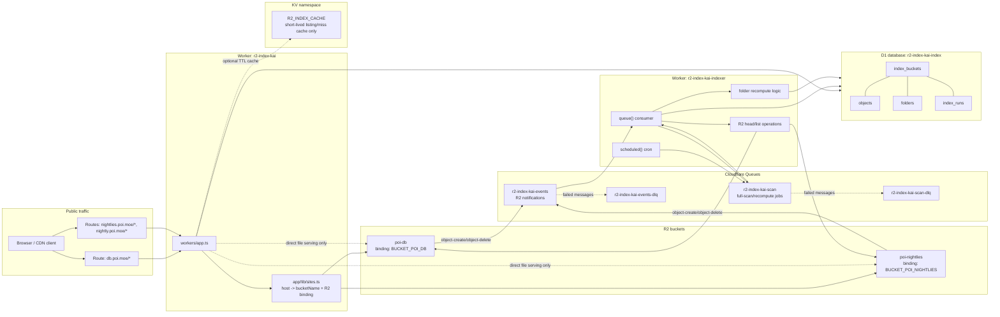

# R2 Offline Directory Index Design

## Goal

Directory listing requests should not scan R2. R2 remains the source of truth for file bodies, but directory metadata is materialized offline into D1 and read by the ingress Worker.

This design makes request-time directory listing complexity proportional to the number of direct children in the requested directory, not the number of descendant objects under that prefix.

```text
R2 bucket
  -> R2 event notification
  -> Cloudflare event Queue
  -> indexer Worker
  -> D1 canonical index
  -> ingress Worker reads D1
```

## Storage decisions

| Data | Storage | Role |
| --- | --- | --- |
| File bodies | R2 | Source of truth |
| File metadata index | D1 | Canonical indexed metadata |
| Folder aggregate index | D1 | Canonical folder size/count/time metadata |
| R2 event stream | Cloudflare Queue | Async indexing and retries |
| Full-scan and recompute jobs | Separate Cloudflare Queue | Isolates heavy jobs from event batching |
| Short-lived listing/miss cache | Existing `R2_INDEX_CACHE` KV | Optional cache only, not source of truth |

D1 is the canonical index store. KV must not be used as the canonical index because folder aggregates require transactional updates, indexed prefix queries, and recomputation after deletes.

## Cloudflare entity graph



Ingress reads D1 for directory listings. The only normal ingress-to-R2 path is direct object serving. R2 listing belongs to the indexer Worker.

## Cloudflare resources

Create one shared D1 database:

```sh
wrangler d1 create r2-index-kai-index
```

Create indexing queues:

```sh
wrangler queues create r2-index-kai-events
wrangler queues create r2-index-kai-events-dlq
wrangler queues create r2-index-kai-scan
wrangler queues create r2-index-kai-scan-dlq
```

Configure R2 event notifications for both buckets:

```sh
wrangler r2 bucket notification create poi-db --event-type object-create --queue r2-index-kai-events
wrangler r2 bucket notification create poi-db --event-type object-delete --queue r2-index-kai-events
wrangler r2 bucket notification create poi-nightlies --event-type object-create --queue r2-index-kai-events
wrangler r2 bucket notification create poi-nightlies --event-type object-delete --queue r2-index-kai-events
```

Use separate notification commands per event type because Cloudflare's documented Wrangler form accepts one `--event-type <EVENT_TYPE>` per command.

## Wrangler configuration

### Ingress Worker

The existing `wrangler.jsonc` should keep current R2 and KV bindings and add the shared D1 binding:

```jsonc
{
  "$schema": "node_modules/wrangler/config-schema.json",
  "name": "r2-index-kai",
  "compatibility_date": "2025-04-04",
  "main": "./workers/app.ts",
  "r2_buckets": [
    { "binding": "BUCKET_POI_DB", "bucket_name": "poi-db" },
    { "binding": "BUCKET_POI_NIGHTLIES", "bucket_name": "poi-nightlies" }
  ],
  "kv_namespaces": [
    {
      "binding": "R2_INDEX_CACHE",
      "id": "4caf510805554a53968fe664289e0b98"
    }
  ],
  "d1_databases": [
    {
      "binding": "R2_INDEX_DB",
      "database_name": "r2-index-kai-index",
      "database_id": "<created-by-wrangler>"
    }
  ],
  "routes": [
    { "pattern": "db.poi.moe/*", "zone_name": "poi.moe" },
    { "pattern": "nightlies.poi.moe/*", "zone_name": "poi.moe" },
    { "pattern": "nightly.poi.moe/*", "zone_name": "poi.moe" }
  ]
}
```

### Indexer Worker

Add `wrangler.indexer.jsonc`:

```jsonc
{
  "$schema": "node_modules/wrangler/config-schema.json",
  "name": "r2-index-kai-indexer",
  "compatibility_date": "2025-04-04",
  "main": "./workers/indexer.ts",
  "workers_dev": true,
  "r2_buckets": [
    { "binding": "BUCKET_POI_DB", "bucket_name": "poi-db" },
    { "binding": "BUCKET_POI_NIGHTLIES", "bucket_name": "poi-nightlies" }
  ],
  "d1_databases": [
    {
      "binding": "R2_INDEX_DB",
      "database_name": "r2-index-kai-index",
      "database_id": "<same-database-id-as-ingress>"
    }
  ],
  "queues": {
    "producers": [
      { "binding": "R2_INDEX_SCAN_QUEUE", "queue": "r2-index-kai-scan" }
    ],
    "consumers": [
      {
        "queue": "r2-index-kai-events",
        "max_batch_size": 25,
        "max_batch_timeout": 10,
        "max_retries": 5,
        "dead_letter_queue": "r2-index-kai-events-dlq",
        "max_concurrency": 4
      },
      {
        "queue": "r2-index-kai-scan",
        "max_batch_size": 1,
        "max_batch_timeout": 5,
        "max_retries": 5,
        "dead_letter_queue": "r2-index-kai-scan-dlq",
        "max_concurrency": 1
      }
    ]
  },
  "limits": {
    "cpu_ms": 300000
  },
  "triggers": {
    "crons": ["17 */6 * * *"]
  }
}
```

R2 writes directly to `r2-index-kai-events`, so the indexer does not need a producer binding for that queue. The indexer does need `R2_INDEX_SCAN_QUEUE` so cron and event handlers can enqueue bounded scan/recompute jobs.

Queue concurrency is intentionally capped because the shared D1 database is single-threaded. Events may run with limited parallelism because each event re-checks current R2 state with `bucket.head()`. Scan and recompute jobs run with `max_concurrency: 1` so full-scan finalization, stale cleanup, and large folder recomputes cannot overlap each other.

## Site mapping

Update `app/lib/sites.ts` so every site exposes a stable bucket name in addition to the R2 binding:

```ts
interface Site {
  title: string
  bucketName: 'poi-db' | 'poi-nightlies'
  bucket: R2Bucket
  description: string
}
```

Example:

```ts
'db.poi.moe': {
  title: 'poi-db monthly dumps',
  bucketName: 'poi-db',
  bucket: env.BUCKET_POI_DB,
  description: 'poi-db monthly dumps',
}
```

The ingress Worker uses `bucketName` for D1 queries and `bucket` only for direct file serving or an explicitly enabled fallback path.

## D1 schema

Add `migrations/0001_index.sql`:

```sql
CREATE TABLE index_buckets (
  bucket TEXT PRIMARY KEY,
  status TEXT NOT NULL DEFAULT 'pending',
  generation INTEGER NOT NULL DEFAULT 0,
  last_scan_started_at INTEGER,
  last_scan_finished_at INTEGER,
  last_event_at INTEGER,
  updated_at INTEGER NOT NULL
);

CREATE TABLE objects (
  bucket TEXT NOT NULL,
  key TEXT NOT NULL,
  parent_prefix TEXT NOT NULL,
  name TEXT NOT NULL,
  size INTEGER NOT NULL,
  uploaded_at INTEGER NOT NULL,
  etag TEXT,
  seen_generation INTEGER NOT NULL DEFAULT 0,
  updated_at INTEGER NOT NULL,
  PRIMARY KEY (bucket, key)
);

CREATE INDEX objects_by_parent
  ON objects(bucket, parent_prefix, name);

CREATE INDEX objects_by_generation
  ON objects(bucket, seen_generation);

CREATE TABLE folders (
  bucket TEXT NOT NULL,
  prefix TEXT NOT NULL,
  parent_prefix TEXT,
  name TEXT NOT NULL,
  size INTEGER NOT NULL DEFAULT 0,
  total_file_count INTEGER NOT NULL DEFAULT 0,
  created_at INTEGER,
  modified_at INTEGER,
  needs_recompute INTEGER NOT NULL DEFAULT 0,
  updated_at INTEGER NOT NULL,
  PRIMARY KEY (bucket, prefix)
);

CREATE INDEX folders_by_parent
  ON folders(bucket, parent_prefix, name);

CREATE INDEX folders_needing_recompute
  ON folders(bucket, needs_recompute);

CREATE TABLE index_runs (
  id TEXT PRIMARY KEY,
  bucket TEXT NOT NULL,
  kind TEXT NOT NULL,
  generation INTEGER NOT NULL,
  cursor TEXT,
  status TEXT NOT NULL,
  lease_expires_at INTEGER,
  started_at INTEGER NOT NULL,
  updated_at INTEGER NOT NULL,
  finished_at INTEGER
);
```

Root folder is represented by `prefix = ''` and `parent_prefix = NULL`.

## Database modeling recommendation

Use Drizzle for schema modeling, query typing, and migration generation, but keep performance-critical indexing operations as explicit D1 prepared SQL.

Recommended package choice for the implementation PR:

```sh
npm install drizzle-orm
npm install --save-dev drizzle-kit
```

Recommended files:

```text
app/lib/db/schema.ts
app/lib/db/client.ts
drizzle.config.ts
migrations/
```

`drizzle.config.ts` should generate SQLite migrations into the same `migrations/` folder used by Wrangler:

```ts
import { defineConfig } from 'drizzle-kit'

export default defineConfig({
  dialect: 'sqlite',
  schema: './app/lib/db/schema.ts',
  out: './migrations',
})
```

Use Drizzle's D1 driver at runtime:

```ts
import { drizzle } from 'drizzle-orm/d1'

const db = drizzle(env.R2_INDEX_DB)
```

Recommended split:

| Area | Use Drizzle? | Reason |
| --- | --- | --- |
| Table definitions | Yes | Single typed schema for Workers and migrations |
| Simple ingress listing reads | Yes | Type-safe reads and result mapping |
| Status/admin queries | Yes | Low complexity and easier maintenance |
| Full-scan upserts | Mixed | Drizzle schema/types are useful, but D1 `batch()` with prepared SQL gives tighter control |
| Folder aggregate recompute | Prefer raw prepared SQL | Aggregate range queries and D1 limits need predictable SQL and binding counts |
| Migrations at runtime | No | Generate SQL ahead of time; apply with Wrangler D1 migrations |

Do not run migration tooling from Workers. Generate migration SQL during development with `drizzle-kit generate`, review the SQL, commit it under `migrations/`, and apply it with:

```sh
wrangler d1 migrations apply r2-index-kai-index --remote
```

Drizzle is recommended here because the schema is non-trivial but still SQLite-compatible. It gives type-safe D1 access without forcing the indexer to hide important D1 performance constraints behind ORM abstractions.

## Prefix rules

Use these helpers consistently:

```ts
const getParentPrefix = (key: string) => {
  const index = key.lastIndexOf('/')
  return index === -1 ? '' : key.slice(0, index + 1)
}

const getName = (key: string) => {
  const index = key.lastIndexOf('/')
  return index === -1 ? key : key.slice(index + 1)
}

const getAncestorPrefixes = (key: string) => {
  const prefixes = ['']
  let slash = key.indexOf('/')
  while (slash !== -1) {
    prefixes.push(key.slice(0, slash + 1))
    slash = key.indexOf('/', slash + 1)
  }
  return prefixes
}

const getPrefixUpperBound = (prefix: string) => {
  if (prefix === '') {
    return null
  }

  const codePoints = Array.from(prefix)
  const last = codePoints.at(-1)
  if (last === undefined) {
    return null
  }

  const lastCodePoint = last.codePointAt(0)!
  if (lastCodePoint >= 0x10ffff) {
    return null
  }

  return `${codePoints.slice(0, -1).join('')}${String.fromCodePoint(lastCodePoint + 1)}`
}
```

For `a/b/file.zip`:

```text
parent_prefix = "a/b/"
name = "file.zip"
ancestors = ["", "a/", "a/b/"]
```

Folder metadata definitions:

```text
folder.size = SUM(size of descendant files)
folder.total_file_count = COUNT(descendant files)
folder.created_at = MIN(uploaded_at of descendant files)
folder.modified_at = MAX(uploaded_at of descendant files)
```

R2 has no real folders, so `created_at` is inferred as the earliest descendant upload time.

Use lexicographic range queries over `(bucket, key)` for descendant scans. Do not use `LIKE prefix || '%'`: Cloudflare D1 documents a 50-byte limit for `LIKE` or `GLOB` patterns, which makes long object prefixes unsafe.

## Ingress listing query

Use a D1 Session for read-only listing queries:

```ts
const db = env.R2_INDEX_DB.withSession('first-unconstrained')
```

`first-unconstrained` allows D1 read replication to serve public directory listings from replicas after the index is ready. Use `first-primary` only for operational/admin views that must observe the newest index write.

For a directory prefix:

```sql
SELECT
  'folder' AS type,
  prefix AS key,
  name,
  size,
  created_at AS created,
  modified_at AS modified
FROM folders
WHERE bucket = ? AND parent_prefix = ?

UNION ALL

SELECT
  'file' AS type,
  key,
  name,
  size,
  uploaded_at AS created,
  uploaded_at AS modified
FROM objects
WHERE bucket = ? AND parent_prefix = ?

ORDER BY type DESC, name COLLATE NOCASE;
```

Request-time complexity:

```text
O(number of direct children in the requested directory)
```

The route should return 404 when:

```text
no matching object rows
and no matching folder rows
and prefix is not root
```

The route should not call `bucket.list()` for normal directory listings.

## Cloudflare documentation constraints

This design depends on these Cloudflare-documented constraints:

| Area | Constraint | Design response |
| --- | --- | --- |
| R2 event notifications | Event types are `object-create` and `object-delete`; Queue message bodies contain `action`, `bucket`, `object.key`, `eventTime`, and omit size/eTag for deletes. | Normalize Cloudflare event bodies before updating D1; use `bucket.head(key)` for current create metadata and stale delete detection. |
| R2 list API | `list()` returns at most 1000 objects, may return fewer, and pagination must use `truncated` and `cursor`. | Full scan jobs always advance by cursor and never infer completion from object count. |
| Queues | Max consumer batch size is 100; consumer wall time is 15 minutes; default CPU is lower unless configured. | Use separate queues, `max_batch_size: 1` for scan jobs, and `limits.cpu_ms: 300000` on the indexer. |
| D1 | One database is single-threaded, max size is 10 GB on Workers Paid, max query duration is 30 seconds, max bound parameters per query is 100, and query count per Worker invocation is limited. | Keep D1 writes bounded, remove the `object_ancestors` table, chunk recomputes, and use KV/read replication for hot listing reads if needed. |
| D1 read replication | Read replicas are only used through the Sessions API. | Ingress listing reads should use `R2_INDEX_DB.withSession('first-unconstrained')` after the index is ready. |
| Queue acknowledgement | Messages are acknowledged when the `queue()` handler resolves; individual messages can also call `ack()` or `retry()`. | Process event messages independently and explicitly `ack()` only after D1 writes plus scan-job enqueue succeed. |

If either bucket's estimated index approaches 5 GB or D1 overload errors appear during scans, split into one D1 database per bucket before adding more features.

Source-of-truth documentation checked for this design:

- https://developers.cloudflare.com/r2/buckets/event-notifications/
- https://developers.cloudflare.com/r2/api/workers/workers-api-reference/
- https://developers.cloudflare.com/queues/configuration/configure-queues/
- https://developers.cloudflare.com/queues/configuration/consumer-concurrency/
- https://developers.cloudflare.com/queues/configuration/javascript-apis/
- https://developers.cloudflare.com/queues/platform/limits/
- https://developers.cloudflare.com/d1/platform/limits/
- https://developers.cloudflare.com/d1/worker-api/d1-database/
- https://developers.cloudflare.com/d1/best-practices/use-indexes/
- https://developers.cloudflare.com/d1/best-practices/read-replication/
- https://orm.drizzle.team/docs/sqlite/connect-cloudflare-d1
- https://orm.drizzle.team/docs/drizzle-kit-generate
- https://orm.drizzle.team/docs/drizzle-kit-migrate

## Indexer job types

R2 event notifications arrive on `r2-index-kai-events` using Cloudflare's documented message body:

```ts
type R2EventNotification = {
  action: 'PutObject' | 'CopyObject' | 'CompleteMultipartUpload' | 'DeleteObject' | 'LifecycleDeletion'
  bucket: 'poi-db' | 'poi-nightlies'
  object: {
    key: string
    size?: number
    eTag?: string
  }
  eventTime: string
}
```

Full-scan and recompute jobs are internal messages on `r2-index-kai-scan`:

```ts
type ScanJob =
  | {
      kind: 'full-scan-page'
      bucket: 'poi-db' | 'poi-nightlies'
      generation: number
      cursor?: string
    }
  | {
      kind: 'finish-full-scan'
      bucket: 'poi-db' | 'poi-nightlies'
      generation: number
    }
  | {
      kind: 'recompute-folders'
      bucket: 'poi-db' | 'poi-nightlies'
      prefixes: string[]
    }
  | {
      kind: 'finalize-full-scan'
      bucket: 'poi-db' | 'poi-nightlies'
      generation: number
    }
```

## Full scan flow

Scheduled handler runs every six hours.

For each configured bucket:

```text
1. If a non-expired scan lease exists for the bucket, skip.
2. Set generation = Date.now().
3. Upsert index_buckets row with status = 'scanning'.
4. Upsert index_runs row with lease_expires_at.
5. Enqueue full-scan-page with no cursor to R2_INDEX_SCAN_QUEUE.
```

`full-scan-page` handler:

```text
1. Resolve bucket name to R2 binding.
2. List R2 with limit 50, no delimiter, and the job cursor.
3. For each object:
   - run `bucket.head(object.key)` and skip the object if it no longer exists
   - use the `head()` result, not the possibly stale list item, for size/uploaded/etag
   - compute parent_prefix, name, ancestors
   - upsert objects row
   - set seen_generation = job.generation
   - ensure folders rows for each ancestor
   - mark affected folders needs_recompute = 1
4. Extend the scan lease.
5. If R2 returned a cursor, enqueue the next full-scan-page.
6. If no cursor, enqueue finish-full-scan.
```

R2 allows up to 1000 listed objects per call, but this design intentionally uses 50. The lower page size keeps D1 writes below per-invocation query limits after folder rows and dirty flags are included.

The per-object `head()` call is intentional. It prevents a full-scan page from resurrecting an object that was listed just before a concurrent delete or overwrite event was processed.

`finish-full-scan` handler:

```text
1. Find stale objects where `seen_generation < generation` and `updated_at < last_scan_started_at`.
2. For each stale object:
   - mark old ancestors needs_recompute = 1
   - delete object row
3. Enqueue recompute-folders jobs in chunks of at most 25 prefixes.
4. Enqueue finalize-full-scan.
```

`finalize-full-scan` handler:

```text
1. If any folders still have needs_recompute = 1, enqueue another finalize-full-scan with delay and return.
2. Delete empty folder rows except the root folder.
3. Mark index_buckets status = 'ready'.
4. Clear the scan lease.
```

The full scan never loads the whole bucket into memory.

## Event update flow

### Create or overwrite

```text
1. Accept actions PutObject, CopyObject, and CompleteMultipartUpload as creates.
2. Resolve event bucket to R2 binding.
3. Run bucket.head(object.key).
4. If head returns null, process as delete.
5. Read old objects row.
6. Upsert the objects row with current size/uploaded/etag.
7. If `index_buckets.status = 'scanning'`, set `seen_generation` to the active bucket generation so a concurrent full scan cannot delete this fresh object as stale.
8. Ensure folder rows exist for all old and new ancestors.
9. Mark all old and new ancestors needs_recompute = 1.
10. Enqueue recompute-folders for those ancestors.
11. Acknowledge the event only after the D1 writes and recompute enqueue succeed.
12. Update index_buckets.last_event_at.
```

Always recompute affected ancestors after event updates. This is slightly more expensive than arithmetic deltas but avoids timestamp edge cases and out-of-order overwrite bugs.

### Delete

```text
1. Accept actions DeleteObject and LifecycleDeletion as deletes.
2. Resolve event bucket to R2 binding.
3. Run bucket.head(object.key).
4. If object still exists, ignore the delete event as stale/out-of-order.
5. Read old objects row.
6. If missing, no-op.
7. Mark old ancestors needs_recompute = 1.
8. Delete object row.
9. Enqueue recompute-folders for old ancestors.
10. Acknowledge the event only after the D1 writes and recompute enqueue succeed.
11. Update index_buckets.last_event_at.
```

Duplicate events are safe because all operations are idempotent.

The event consumer should not process a whole batch with `Promise.all` and then rely on all-or-nothing batch acknowledgement. Process each message independently with bounded concurrency, call `message.ack()` after that message's D1 writes and scan-queue enqueue succeed, and call `message.retry({ delaySeconds })` for recoverable D1/R2/Queue failures.

## Folder recomputation

Each `recompute-folders` job must contain at most 25 prefixes. For each prefix, compute `upperBound = getPrefixUpperBound(prefix)` and run one aggregate query.

For the root prefix, omit the upper-bound predicate:

```sql
SELECT
  COALESCE(SUM(size), 0) AS size,
  COUNT(*) AS total_file_count,
  MIN(uploaded_at) AS created_at,
  MAX(uploaded_at) AS modified_at
FROM objects
WHERE bucket = ?;
```

For non-root prefixes:

```sql
SELECT
  COALESCE(SUM(size), 0) AS size,
  COUNT(*) AS total_file_count,
  MIN(uploaded_at) AS created_at,
  MAX(uploaded_at) AS modified_at
FROM objects
WHERE bucket = ?
  AND key >= ?
  AND key < ?;
```

Then update the folder:

```sql
UPDATE folders
SET
  size = ?,
  total_file_count = ?,
  created_at = ?,
  modified_at = ?,
  needs_recompute = 0,
  updated_at = ?
WHERE bucket = ?
  AND prefix = ?;
```

After a recompute sets `total_file_count = 0`, delete that folder row unless `prefix = ''`.

## Worker code layout

Do not convert this repository into a monorepo for the first implementation. Keep one npm package with multiple Worker entrypoints and multiple Wrangler configs.

Reasons:

- The ingress Worker and indexer Worker share the same Cloudflare account resources, D1 schema, bucket names, and TypeScript types.
- The dependency set is small; separate packages would add workspace/build complexity without isolating much.
- The current repository already has a single React Router app plus `workers/app.ts`; adding `workers/indexer.ts` fits the existing shape.
- Deployment separation is already handled by separate Wrangler configs, so package separation is not required.

Use this layout:

```text
app/
  lib/
    index-db.ts              # ingress-side read queries only
    sites.ts                 # host -> bucketName + R2 binding
  routes/
    catch-all.tsx

shared/
  buckets.ts                 # bucket-name constants and binding resolver types
  prefix.ts                  # getParentPrefix/getName/getAncestorPrefixes helpers
  db/
    schema.ts                # Drizzle table definitions
    types.ts                 # shared row/result types

workers/
  app.ts                     # existing React Router ingress Worker entry
  indexer.ts                 # indexer Worker entrypoint: queue() + scheduled()
  indexer/
    jobs.ts                  # ScanJob and dispatch helpers
    r2-events.ts             # R2 notification normalization and event handling
    folders.ts               # folder recompute logic
    full-scan.ts             # paginated R2 scan jobs
    buckets.ts               # R2 binding resolver for indexer

wrangler.jsonc               # ingress Worker config
wrangler.indexer.jsonc       # indexer Worker config
drizzle.config.ts
migrations/
```

`shared/` is pure TypeScript. It must not import React, React Router, Worker entry modules, or request-specific code. Both `app/` and `workers/` may import from `shared/`.

Update TypeScript/Vite path aliases when adding `shared/`:

```jsonc
{
  "compilerOptions": {
    "paths": {
      "@/*": ["./app/*"],
      "~/*": ["./shared/*"]
    }
  }
}
```

Also add `shared/**/*` to `tsconfig.cloudflare.json` includes. For Vite, keep `@` for app imports and add a `~` alias to `./shared`.

Rules:

- `app/lib/index-db.ts` contains ingress-side D1 reads only.
- `workers/indexer/*` contains all D1 writes, full scans, Queue handling, and folder recompute logic.
- `shared/db/schema.ts` is the only schema definition source used by Drizzle and runtime code.
- Do not import from `app/` inside `workers/indexer/*`; use `shared/` instead.
- Do not import from `workers/` inside React components; route loaders should use `app/lib/*` and `shared/*`.

Reconsider a monorepo only if the project later has independent deploy pipelines, incompatible dependency sets, or reusable packages published outside this repository.

## Ingress fallback policy

Use a configuration flag:

```ts
INDEX_LIVE_FALLBACK = false
```

Production target behavior:

```text
manifest/index ready -> read D1 and render
index missing/stale -> return 503 "index not ready" or 404 when prefix is known absent
```

During migration only:

```text
if INDEX_LIVE_FALLBACK is true:
  live-scan R2
  return listing
  enqueue scan/recompute
```

Fallback should be disabled once both buckets are fully indexed.

## Complexity

| Operation | Complexity |
| --- | --- |
| Directory request | O(direct children) |
| Full scan | O(total objects * path depth), offline |
| Create/overwrite event | O(path depth) for event write, plus queued recompute |
| Delete event | O(path depth) for event write, plus queued recompute |
| Folder recompute | O(descendant files of dirty folder), offline range query |

The important constraint is that expensive descendant work happens in the indexer, not in the ingress request path.

## Deployment sequence

1. Create D1 database and all four Queues.
2. Add D1 binding to `wrangler.jsonc`.
3. Add `wrangler.indexer.jsonc`.
4. Add D1 migration and apply it:

   ```sh
   wrangler d1 migrations apply r2-index-kai-index --remote
   ```

5. Deploy indexer Worker.
6. Configure R2 event notifications for both buckets.
7. Trigger or wait for a full scan for `poi-db` and `poi-nightlies`.
8. Confirm `index_buckets.status = 'ready'` for both buckets.
9. Change ingress directory listing route to read from D1.
10. Deploy ingress Worker.
11. Enable D1 read replication if listing latency or read throughput becomes a bottleneck.
12. Disable live R2 listing fallback in production.

## Operational checks

Useful D1 checks:

```sql
SELECT bucket, status, generation, last_scan_finished_at, last_event_at
FROM index_buckets;
```

```sql
SELECT bucket, COUNT(*) AS object_count
FROM objects
GROUP BY bucket;
```

```sql
SELECT bucket, COUNT(*) AS dirty_folders
FROM folders
WHERE needs_recompute = 1
GROUP BY bucket;
```

The indexer should log:

```text
bucket
job kind
generation
cursor presence
objects processed
folders recomputed
queue batch size
error details
```

Avoid swallowing indexing errors; failed Queue messages should retry and eventually land in the dead-letter queue.
